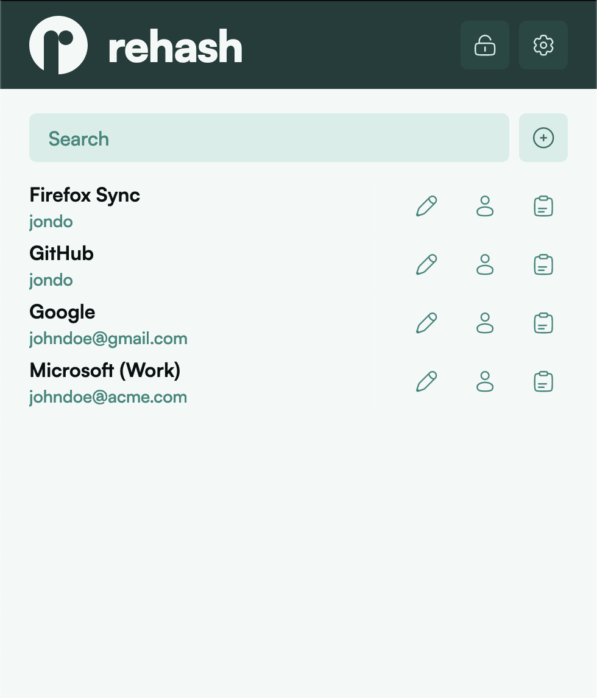

# rehash

The password manager that does not save your passwords.

[Open App](https://app.rehash.one)

# What is rehash?

rehash is a password manager that generates your passwords on the fly based on your master password, the site you're saving the password for and your username.

This allows you to generate a seemingly random password for every site, while also being able to access that same password from other devices without having to upload it into the cloud.

rehash is based on [PwdHash](https://crypto.stanford.edu/PwdHash/), an approach to eliminate password reuse that was published at Stanford University. It extends on this approach and packages it in a beautiful, modern web application.

# How does it work?

Your password is generated using a cryptographic hash function, a one-way mapping from any input data to a unique identifier of that data.

Here are some examples:

|           Password           |      Site      | Username           | Generated Password               |
| :--------------------------: | :------------: | ------------------ | -------------------------------- |
|           hunter2            | www.google.com | jondoe@gmail.com   | h5cTlQyD0lyC42l2A6im6evdb4PAlTNS |
|           hunter2            | www.google.com | janedoe2@gmail.com | Dzy7WnDSccyfYlQ1D5zZa3ug+2T/6q/L |
|           hunter2            | www.github.com | jondoe@gmail.com   | fnKBaQWSKiogGfyq4IzramxB8bgxY/B/ |
| correct-horse-battery-staple | www.github.com | jondoe@gmail.com   | d29xR+GYDQFLswzxDyjYI/ZVZ/ws9wqj |

It is ensured that there is no computationally feasible way to get from the output (generated password) of the hash function to the input (password, site and username).

rehash uses the [Argon2id](https://github.com/P-H-C/phc-winner-argon2) function to generate the hash.

# Is rehash for me?

Probably not. It caters to a niche audience. A normal password manager is the way to go for most intents and purposes. I would highly recommend [Bitwarden](https://bitwarden.com/).

The major drawbacks of rehash are:

- Changing the master password changes all your passwords.
- Changing a single password is difficult (there is support for password iterations, but it is only an alleviation, not a solution)
- It is not as secure as a password manager with truly randomly generated passwords.

The type of person rehash is for could be described like this:

- Does not want their passwords stored in the cloud (encrypted or not - it's about the principle)
- Uses many different devices, so using a traditional offline password manager like [KeePass](https://keepassxc.org/) is unviable
